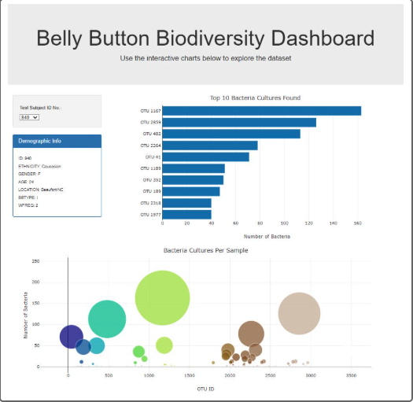

# **Belly Button Biodiversity: Interactive Dashboard Project**

Created by Matthew Guy, 2025

An interactive dashboard project exploring microbial species found in human navels using **D3.js, Plotly.js, and JavaScript**. This project involves **loading, filtering, and visualizing** sample data from individuals to uncover trends in microbial presence.

---

## **Table of Contents**
- [Features](#features)
- [Installation](#installation)
- [Usage Instructions](#usage-instructions)
- [Dataset Details](#dataset-details)
- [Dashboard Functionality](#dashboard-functionality)
- [Dashboard Preview](#dashboard-preview)
- [Deployment](#deployment)
- [Future Enhancements](#future-enhancements)
- [About](#about)
- [Resources](#resources)

---

## **Features**

**Interactive Dropdown**: Select a test subject ID to update charts and metadata dynamically.  
**Bar Chart**: Horizontal bar chart displaying the top 10 OTUs (Operational Taxonomic Units) for the selected individual.  
**Bubble Chart**: Visualizes the full microbial population per sample using marker size and color to reflect frequency and identity.  
**Demographic Panel**: Displays real-time metadata about the selected test subject.  
**Responsive Layout**: Utilizes Bootstrap to ensure clean presentation and chart alignment.

---

## **Installation**

### **Requirements**
- GitHub Account  
- VS Code or Web Editor  
- Basic HTML/CSS/JS knowledge

### **Quick Start Setup**

1. Clone or download the repository.  
2. Open the project in VS Code or your preferred editor.  
3. Ensure files are in the correct structure:

&nbsp;&nbsp;&nbsp;&nbsp;📁 belly-button-challenge  
&nbsp;&nbsp;&nbsp;&nbsp;├── index.html  
&nbsp;&nbsp;&nbsp;&nbsp;├── app.js  
&nbsp;&nbsp;&nbsp;&nbsp;├── samples.json  
&nbsp;&nbsp;&nbsp;&nbsp;├── README.md  
&nbsp;&nbsp;&nbsp;&nbsp;└── images/  
&nbsp;&nbsp;&nbsp;&nbsp;&nbsp;&nbsp;&nbsp;&nbsp;└── dashboard_screenshot.png  

4. Launch `index.html` in a web browser to run locally.  
5. Optionally deploy to GitHub Pages to make it live online.

---

## **Usage Instructions**

- Open the dashboard in a browser.  
- Use the dropdown menu to select a sample ID.  
- Observe updates to:  
  - Top 10 Bacteria Cultures (Bar Chart)  
  - All Cultures Per Sample (Bubble Chart)  
  - Demographic Info Panel

---

## **Dataset Details**

- Source: `samples.json` provided in the Module 14 starter files.  
- Contains microbial data (OTUs) collected from human belly buttons.  
- Metadata includes age, gender, ethnicity, location, washing frequency, and more.

---

## **Dashboard Functionality**

- Built with **D3.js** to read JSON data and populate HTML elements.  
- **Plotly.js** used to render dynamic bar and bubble charts.  
- Charts and metadata auto-update with each dropdown selection.

---

## **Dashboard Preview**

The interactive dashboard shown above displays real-time data for selected test subjects. It includes:

- A dropdown menu to choose a subject ID  
- A bar chart highlighting the top 10 most prominent bacterial cultures (OTUs)  
- A bubble chart representing all bacterial cultures per sample  
- A demographic panel showing age, gender, ethnicity, location, and washing frequency  

All visualizations update instantly based on user selection, providing a clear and interactive exploration of the belly button microbiome dataset.

---

## **Deployment**

This application is deployed via GitHub Pages and can be accessed here:  
🔗 [Live Dashboard](https://mattguy22.github.io/belly-button-challenge/)  

---

## **Future Enhancements**

- Add washing frequency gauge chart.  
- Enhance styling with custom CSS themes.  
- Implement loading spinner while data loads.  
- Add chart tooltips or filtering options for advanced exploration.

---

## **About**

This project was built as part of the Module 14 Challenge. It reinforces core concepts in JavaScript, DOM manipulation, D3, and Plotly.js for data-driven interfaces.

---

## **Resources**

- [D3.js Documentation](https://d3js.org)  
- [Plotly.js Docs](https://plotly.com/javascript/)  
- [Bootstrap](https://getbootstrap.com)  
- [Starter Dataset](https://static.bc-edx.com/data/dl-1-2/m14/lms/starter/samples.json)
- **DU Bootcamp Module 14 & 15**: Used to help with the function build for both charts. syntax, rendering the charts, and syntax for function to run on page load.  
- **ChatGPT**: Assisted with how to deploy the app to a free static page hosting service GitHub Pages.  